# 王国保卫战 Dove 版 Wiki

欢迎来到 KingdomRushDove Wiki！这里收录了游戏的防御塔、科技、英雄、自制关卡等详细资料。

---

## 📖 板块导航

- [🏰 防御塔](/wiki/towers) — 全系列防御塔数据与平衡调整
- [⚗️ 科技](/wiki/tech) — 科技树与升级详解
- [🦸 英雄](/wiki/heroes) — 英雄能力与攻略
- [🗺️ 自制关卡](/wiki/custom_levels) — 社区自制地图与挑战

---

# 王国保卫战 Dove 版

王国保卫战 Dove 版是一款旨在优化平衡性、加强可操作性、可拓展性、提高游戏性能的多代移植改版。它是国内第一个拥有官方服务器、支持自动更新、提供插件商店的王国保卫战改版。

## 移植

Dove 版移植了 1, 2, 3, 5 代的大部分可玩内容，包括全部英雄、防御塔和地图。你可以在任何关卡使用所有已移植的防御塔。

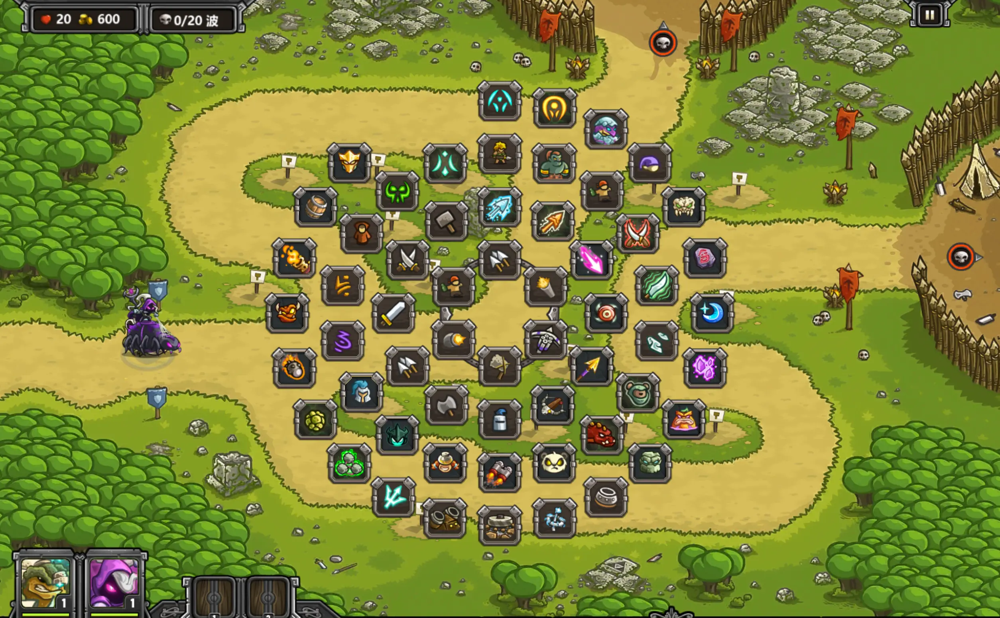

在战胜对应关卡后，即可解锁英雄。


## 平衡

Dove 对基本全部防御塔和英雄做了平衡性调整。本着不做削弱的原则，为保证难度，提高了敌人的数值。

- 老兵难度下，经济更低，英雄升级更难，敌人后期出兵更快。
- 不可能难度下，敌人数值更高，高生命单位受到非变形秒杀时转化为最大生命值伤害，且后期数值继续提高。

调整示意：

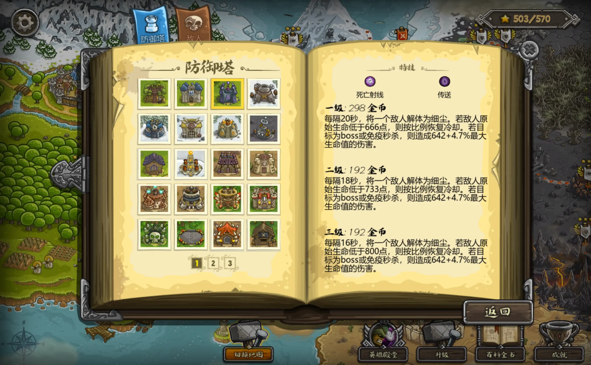

## 科技

- 开放 6 级科技，两条科技线，实现了智能火雨。

## 可操作性

- 援兵可调集。
- 大量召唤物可调集。
- 开放自定义键位配置。

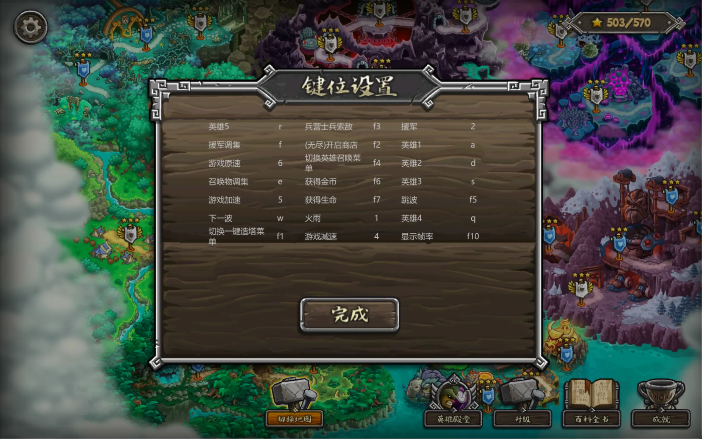

## 可拓展性

- 开放了大量自定义配置项。

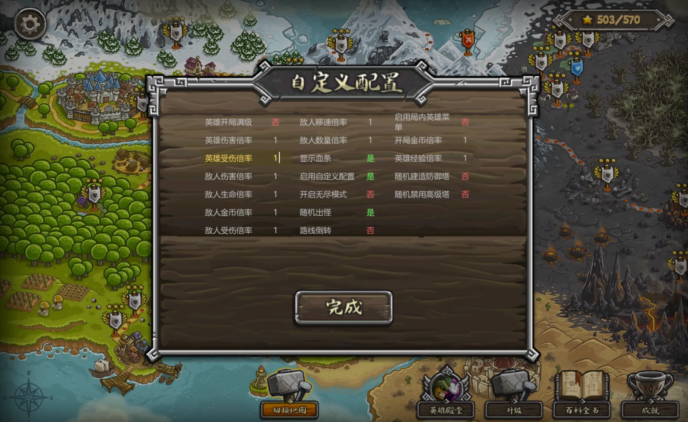

- 开放了插件系统。

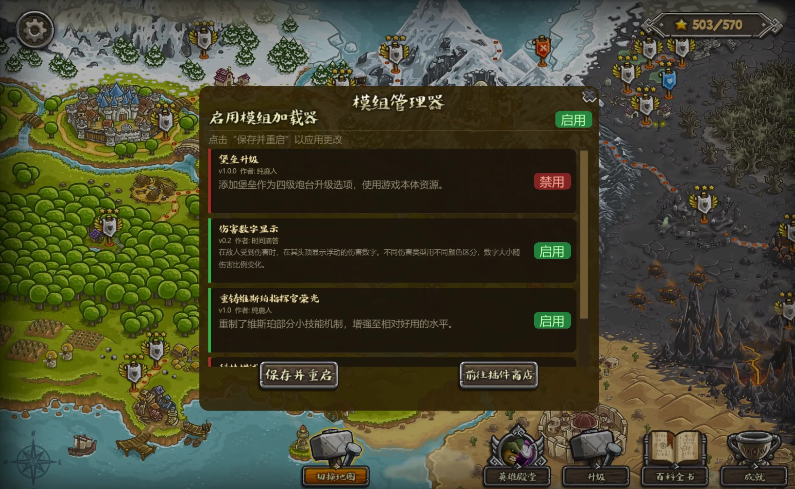

## 新地图

原创自制关卡示意：

### 冰河裂谷

将军，战争还没有结束！

一股强盗从我们的围剿中逃脱，并和冰川残余的巨魔部族汇合，相互勾结！北方的蜘蛛竟也找上门来，在这片土地上编织新的巢穴！

强敌云集，危云密布，但也正是建功立业的好机会！士兵们，带上冬装，麦酒与武器，进军冰河裂谷——在邪恶的力量卷土重来之前！

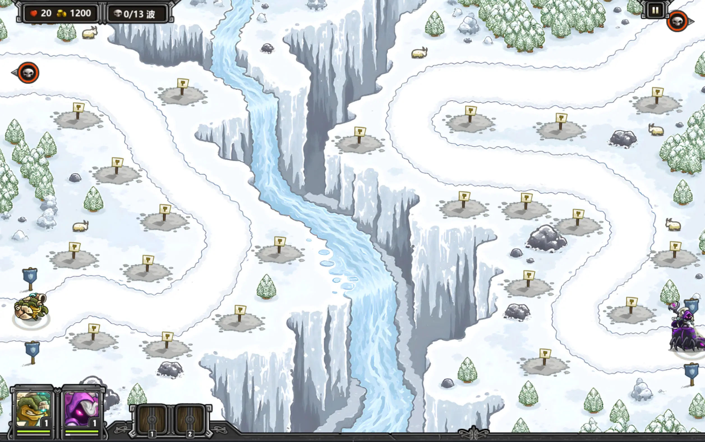

### 无眠林冢

将军！布莱克本的灵魂虽已消逝，这片土地上的邪灵且仍未散去！

无眠林冢中，亡界与生界的界限在每个月圆之夜变得模糊，狼人的咆哮在诡异树木间游走，贼心不死的邪恶法师们正在酝酿着新的阴谋。我们必须阻止他们，否则整个利尼维亚都将陷入黑暗之中！

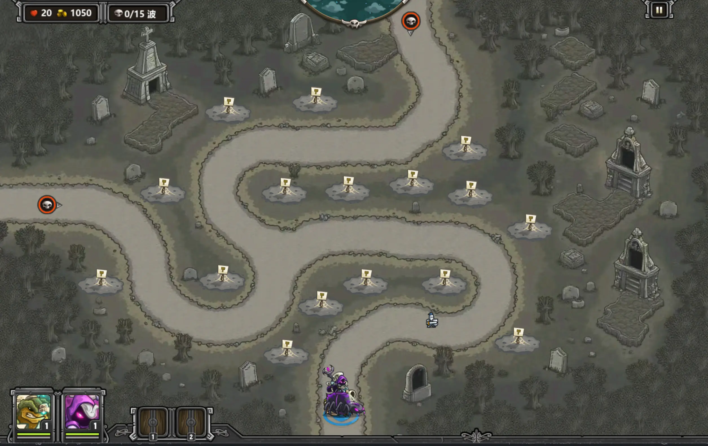

### 风暴环礁之夜

利维坦已被降伏，但是潮水仍未退去！海神殿的祭司发来警告，风暴环礁的圣息近日变得十分微弱！

我们的老朋友黑胡子通过酒馆传来了消息，不死族的身影开始在风暴环礁游荡，残忍的深海恶魔在永夜中舔舐着伤口。将军，我们必须整合军队，驱散这里的邪恶！

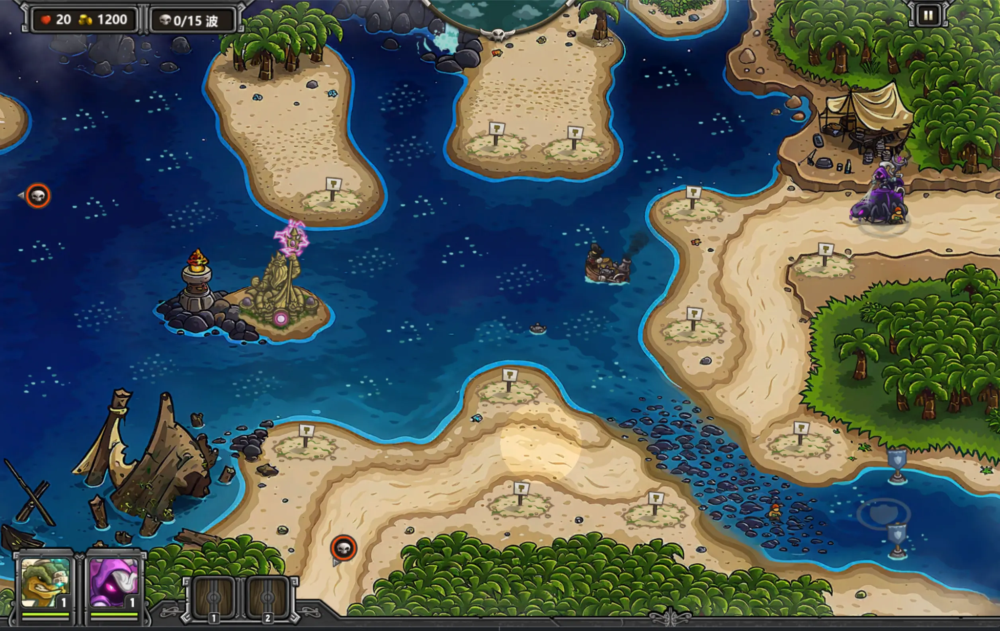

### 林渊蛛巢

将军！我们的亚马孙盟友发现，雨林的蜘蛛近日异常疯狂！一些寄住的森林精灵则报道称，丛林中同时找到了北方蜘蛛和南方蜘蛛的痕迹！我可以预感到，一个巨大的阴谋正在酝酿……将军，我们需要你和你勇敢的士兵们前往林渊，一探究竟，将这些邪恶的节肢动物消灭殆尽！

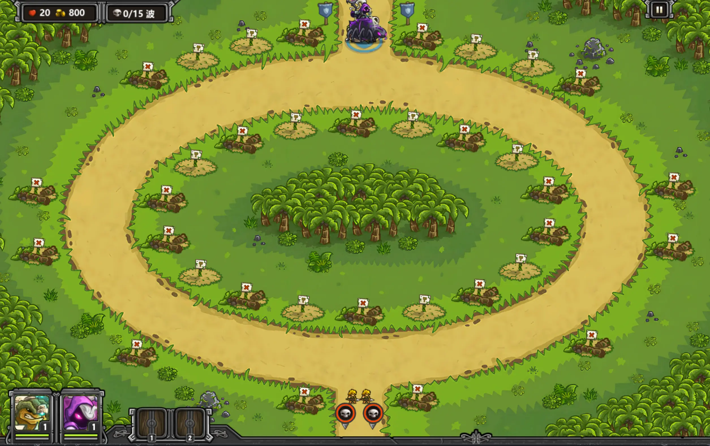

### 撼天墟谷

将军！最新的情报显示，一股诡异的力量正在林渊谷地回荡。我们的侦察兵报告，有野蛮人萨满正在用古老的禁术扰动大地，引发无法解释的重力紊乱——巨石上浮、炮弹失控，连箭矢的轨迹都开始扭曲！据说这些萨满妄图利用这股力量唤醒某种沉眠已久的远古怪物。若任由他们继续仪式，整个雨林都将被撕裂、坠落、覆灭！将军，请率领你的军队深入撼天墟谷，粉碎他们的邪术，让大地重新回到正常的秩序之中！

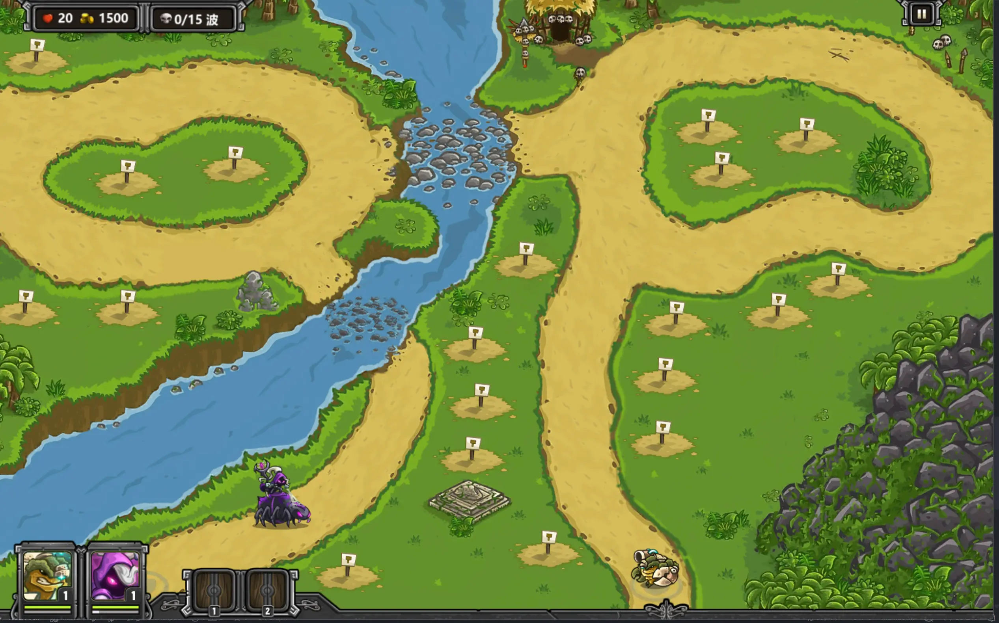

### 呼啸沙坟

将军！我们的牧民报告遇见了极不寻常的“沙尘暴！”

毒虫从飞沙中显现，劫匪从龙卷中降临，这种沙漠民族的古老巫术重现人世，定埋藏着不为人知的阴谋！

让我们集结部队，在呼啸的沙漠中一探究竟！

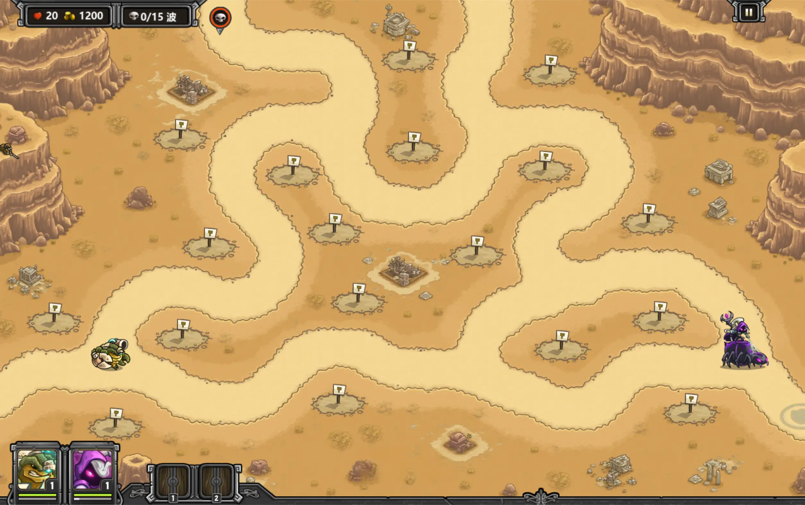

### 失落庭园

将军！

在上一次满月时，我们的魔法师发现了强烈的魔力波动。一日后，驻扎在血石矿场的哨兵来报，矿场的深处发现了一个古老的庭园。这座庭园和我们的皇家庭园极为相似，却处处散发着破败与诡异的气息。我们派出了精锐的咏剑士进一步探索，却无人回归……

将军，我们需要你和你勇敢的手下前往这座失落的庭园，查明这里的真相！

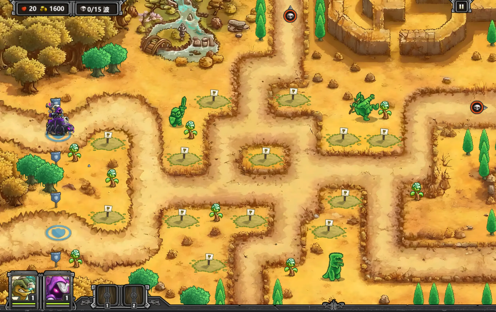

## 斗蛐蛐

本改版提供了用户自定义斗蛐蛐的功能。

在 `patches` 文件夹中提供了 `criket_template.lua` 作为斗蛐蛐文件的参考模板。

```lua
-- 这是一个编辑斗蛐蛐出怪的样例文件
-- 你可以在同一文件夹中创建一个名为 criket.lua 的新文件来定义你的斗蛐蛐波次
-- 若你的 criket 缺少一些设置将会使用本文件的设置
return {
	on = false, -- 是否启用斗蛐蛐，需要则置为 true
	cash = 50000, -- 初始金币
	groups = {
		{ -- 第 1 组出怪
			path_index = 1, -- 设置出怪路径为 1（至少为 1）
			delay = 5, -- 开始出这组怪的延迟，单位为秒
			spawns = {
				{ -- 出怪 1
					creep = "enemy_goblin", -- 选择出怪：哥布林
					max = 100, -- 总数量
					interval = 0.1, -- 每隔 0.1 秒出一个哥布林
					fixed_sub_path = 0, -- 子路径，0 为随机
					interval_next = 5, -- 出完后，过 5 秒出下一怪
				},
				{ -- 出怪 2
					creep = "enemy_fat_orc", -- 选择出怪：兽人
					max = 50, -- 总数量
					interval = 0.2, -- 每隔 0.2 秒出一个兽人
					fixed_sub_path = 0, -- 子路径，0 为随机
					interval_next = 0,
				},
			},
		},
		{ -- 第 2 组出怪
			path_index = 1, -- 设置出怪路径为 1
			delay = 0, -- 开始出怪前的延迟，单位为秒
			spawns = {
				{ -- 出怪 1
					creep = "enemy_goblin", -- 选择出怪：哥布林
					max = 100, -- 总数量
					interval = 0.1, -- 每隔 0.1 秒出一个哥布林
					fixed_sub_path = 0, -- 子路径，0 为随机
					interval_next = 5, -- 出完后，过 5 秒出下一怪
				},
			},
		},
	},
	required_textures = { -- 启用的贴图列表
		"go_enemies_acaroth",
		"go_enemies_ancient_metropolis",
		"go_enemies_bandits",
		"go_enemies_bittering_rancor",
		"go_enemies_blackburn",
		"go_enemies_desert",
		"go_enemies_elven_woods",
		"go_enemies_faerie_grove",
		"go_enemies_forgotten_treasures",
		"go_enemies_grass",
		"go_enemies_halloween",
		"go_enemies_hulking_rage",
		"go_enemies_ice",
		"go_enemies_jungle",
		"go_enemies_mactans_malicia",
		"go_enemies_rising_tides",
		"go_enemies_rotten",
		"go_enemies_sarelgaz",
		"go_enemies_storm",
		"go_enemies_torment",
		"go_enemies_underground",
		"go_enemies_wastelands",
	},
	required_sounds = { -- 启用的音效列表
		"hero_gerald", -- 比如说，有一个特殊的英雄 boss gerald，可能就需要他的音效
	},
}
```

您可以在**存档位置**中找到 `criket.lua` ，并通过修改它的方式自定义斗蛐蛐出怪。另外，只有在 `on` 置为 `true` 时，斗蛐蛐文件才生效。

- 注：您自己的存档可以在 `KingdomRushDove` 目录提供的快捷方式 `存档位置` 中查询。

在选关阶段，您可以通过点击 `f2` 键的方式呼出斗蛐蛐配置界面，决定是否启动斗蛐蛐模式。

## 优化

- 美术资源部分高清化，并基本全部 dds 化，局内纹理内存仅 300 MB。
- 安卓端全部使用 astc 格式纹理，安装包仅有 400-600 MB。
- 使用 C 结构体优化原版系统代码，重写索敌模块，大量删减冗余代码检查，开放 144 帧率。在 AMD Ryzen 9 7945HX + NVIDIA GeForce RTX 4060 Laptop GPU 测试下，可支持游戏在 1024 倍速运行时稳定在 144 帧。
- 精细的 gc 管理和采用缓存的实体数据库，大大优化进出关卡速度。
- 可配置的启动项，让你立刻启动游戏，跳过一切不必要步骤。
